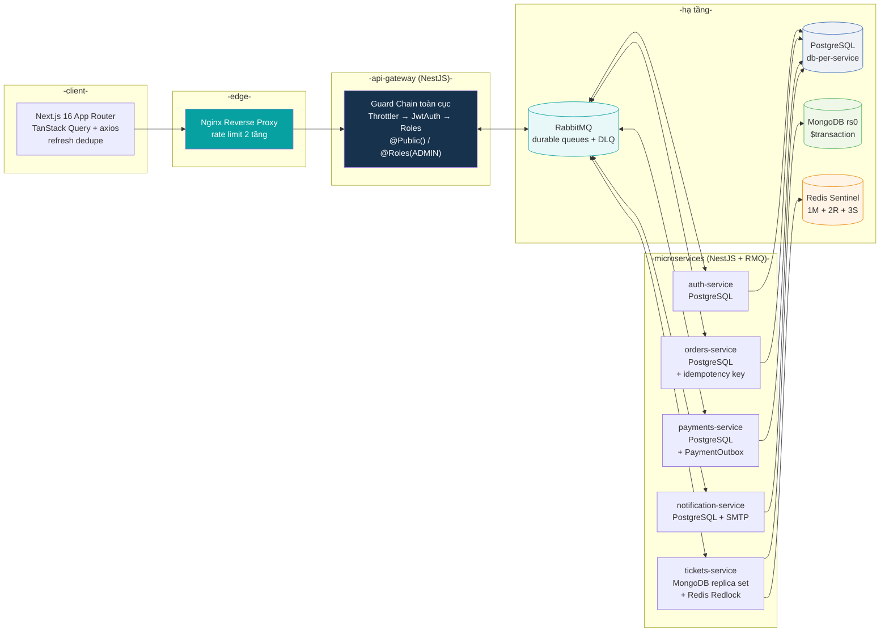
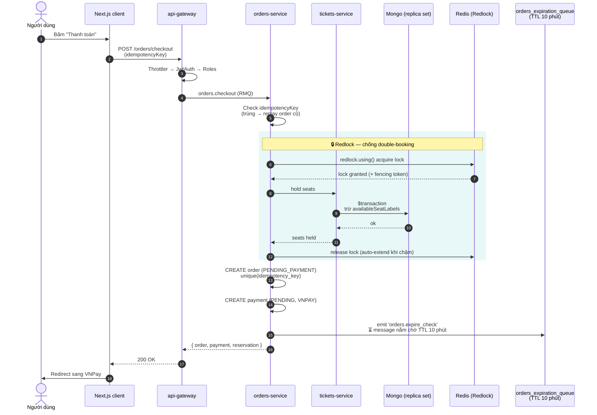
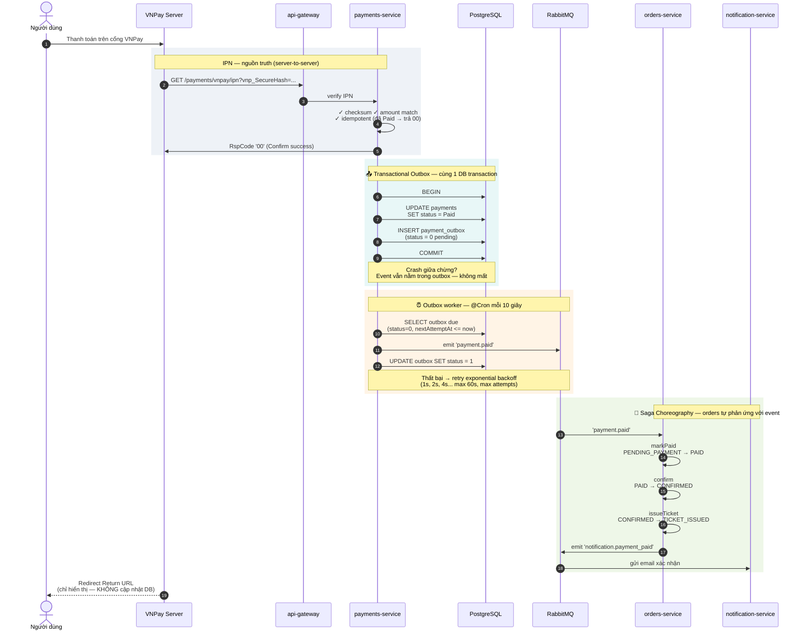
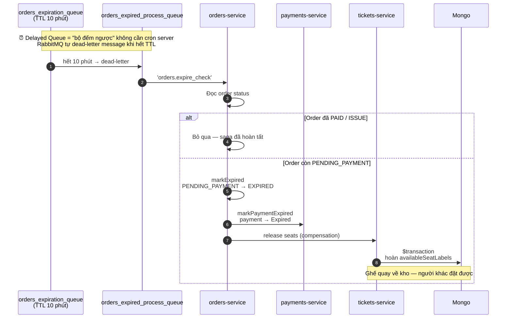
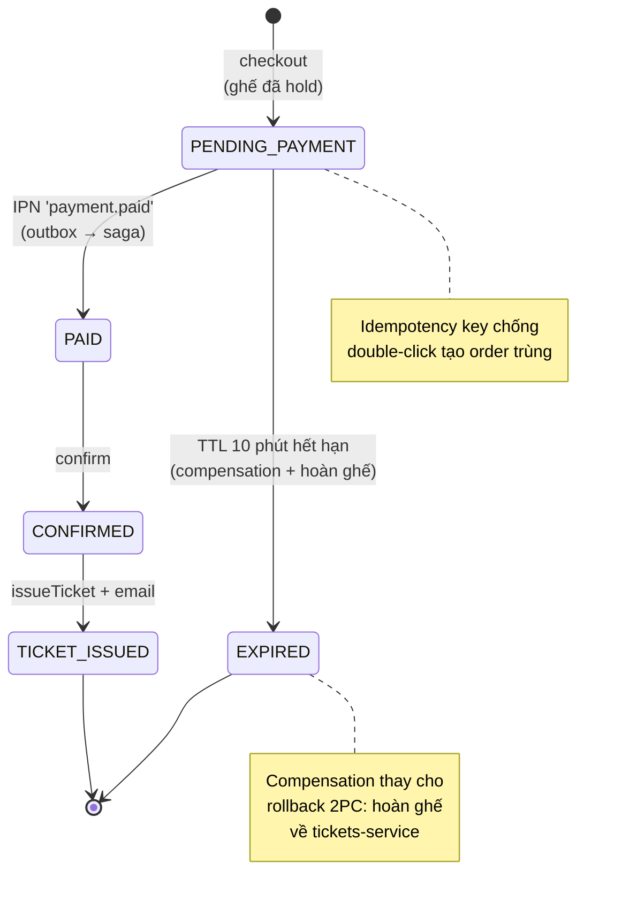
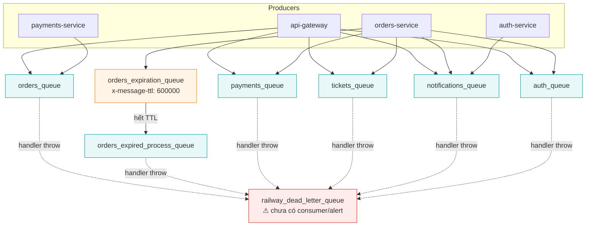

# Kiến trúc & Luồng thanh toán — Diagrams (Mermaid)

> Xem trực tiếp trên GitHub, VS Code (extension *Markdown Preview Mermaid Support*), hoặc dán vào [mermaid.live](https://mermaid.live).

---

## 1. Kiến trúc tổng thể hệ thống

---

## 2. Giai đoạn 1 — Checkout & giữ ghế (Redlock + Idempotency + Delayed Queue)

---

## 3. Giai đoạn 2 — Thanh toán thành công (IPN + Transactional Outbox + Saga)

---

## 4. Giai đoạn 3 — Compensation: hết hạn / thanh toán thất bại

---

## 5. Tổng quan 3 nhánh số phận của một Order (state machine)

---

## 6. Ma trận Queue RabbitMQ

